Carving
==============================

## Introduction

This is a small 3D first person shooter (FPS) game that allows player to modify the terrain by pulling and pushing the vertices and triangles, inspired by Minecraft.  

After learning OpenGL, I finally can start my dream when I was a child -- **BUILD A 3D GAME!!** I played a lot of video games when I was little. At the time I want to understand how to create such games. Nowadays, there are a lot games, but they are are very alike. I want to create something different. Minecraft is a open, sandbox game which allows player to create and modify the world inside the game as much as possible. It is not only a game, it's a platform that even allows player to **CREATE** games on the game itself. Also, I want Minecraft to be more detailed in order to make the game more beautiful. Finally, I decided to use vertices and triangles to let player create their own world!

This small application has the first step of that purpose -- pushing, pulling and changing materials for the vertices and triangles. This also include some feature done by previous homeworks like wall with collision detection and monster wondering in the scene.

#### Feature

 * Cross-platform (tested on Mac and Windows)
 * Unlimited world just like Minecraft
 * First Person Shooter (FPS) control
 * The terrain can be modified by pulling and pushing the vertex
 * Use chunks to index the objects in the game (to boost overall speed)
 * Expandable for future developing (Organized with classes)
 * Use parameter to choose model to load for monsters

## Author & Member contribution

### Team 2

 * 4101056017 資工三 邱冠喻 100%
    * Modified from the complete Homework 5

> Completed on 2015/6/26

## Goal

 * Unlimited world without pre-generation
 * A modifiable world by pulling and pushing the vertices or triangles
 * User can put monsters, wall in the world
 * Monsters and user can attack each other by short-range attack and two kind of long-range attack

## Content & Usage

#### Compilation

 * First get the source code, `git clone` this repo or download the zip and extract it somewhere
 * Get the dependencies,
    * if you are using Microsoft Visual Studio, 
        * Go to [Transmission Zero](http://www.transmissionzero.co.uk/software/freeglut-devel/) to download the latest `freeglut for MSVC`
            * extract `freeglut\bin\freeglut.dll` to the `Release` directory of this repo
            * extract `freeglut\lib\freeglut.lib` to the `lib` directory of this repo
            * extract all contents of `freeglut\include\GL` to the `Carving\GL\` folder of this repo
        * Go to [glew](http://glew.sourceforge.net/) to download `Windows 32-bit and 64-bit` Binaries
            * extract `glew-*\lib\Release\Win32\glew32.lib` to the `lib` directory of this repo
            * extract `glew-*\include\GL\glew.h` to `Carving\GL\` folder of this repo
    * if you are using OSX, open a terminal and use [brew](http://brew.sh/) to install `glew`:
        * (if you don't have `brew` installed) follow the instructions on [brew](http://brew.sh/) to install it.
        * do this command on terminal: `brew tap homebrew/versions`
        * do this command on terminal: `brew install glfw3 glew`
 * And compile of course,
    * With Microsoft Visual Studio, open the `Carving.sln` directly and build it with `Release` configuration, this will generate `Release\Carving.exe`
    * With OSX terminal,
        * `cd <this_repo>`
        * `make`
        * then the executable `OSX_build/Carving` should be generated.

#### Start the game Using Console

Commandline usage:

```
Carving[.exe] [Model_0_path] [Model_1_path] [Model_2_path]
```

 * if `[Model_0_path]` specified, will use `./data/Hulk.obj` for model 0
 * if `[Model_1_path]` specified, will use `./data/Luigi_obj.obj` for model 1
 * if `[Model_2_path]` specified, will use `./data/mario_obj.obj` for model 2

> You need to ensure these obj file exists in order to run

#### Start the Game : Windows

To start the game on windows, just double click on the `Release\Carving.bat`, the basic parameter is written in the `bat` file.  

You can also use `CMD` and execute the `Release\Carving.exe` with commandline usage above to start the game  

#### Start the Game : OSX

To start the game on OSX, use a terminal and execute `OSX_build/Carving.sh`.  

You can also use terminal and execute the `OSX_build\Carving` with commandline usage above to start the game  

#### Game Controls

```
Carving
========================
A small 3D First Person Shooter (FPS) game that the terrain cam be modified by pulling and pushing the vertices and triangles

movement controls:
keyboard `d` key to walk forward
keyboard `s` key to walk backward
keyboard `a` key to walk left
keyboard `d` key to walk right
keyboard ` ` (space) key to fly (or jump)
keyboard `c` key to lower the body

click on the game window to start First Person Shooter (FPS) mode, then
1. Use mouse move to move the FOV (or the head)
2. Use `ESC` key to exit FPS mode

tool controls:
keyboard `z` key to change left hand tools*
keyboard `x` key to change right hand tools*
keyboard `l` key to toggle head light
mouse left key to use left hand tool
mouse right key to use right hand tool

other controls:
keyboard `p` key to toggle polygon offset mode
keyboard 'k' key to suicide
keyboard 'm' key to toggle frames per second (FPS) and debug message
keyboard `ESC` key to exit First Person Shooter (FPS) or exit the game

hand tools:
1. Unarmed: attack a monster in front of user with 10 damage
2. Painter: a solar system that change the color (material) of the locked triangle
3. Bat: attack a monster in front of user with 20 damage
4. Surface Pusher: push a vertice or triangle in front of user
5. Surface Puller: pull a vertice or triangle in front of user
6. Wall Builder: build a wall ahead of user
7. Spell - Rectangle Bomb: put a Rectangle Bomb that cause 20 damage ahead of user
8. Spell - Circle Bomb: put a Circle Bomb that cause 30 damage ahead of user
9. Monster Creator: put a monster ahead of user
```

#### Result, Contents & DEMO

This is a demo on windows, double click on the `Release\Carving.bat` to run, this will bring up a console loading `obj` file and display manual before start the game:  

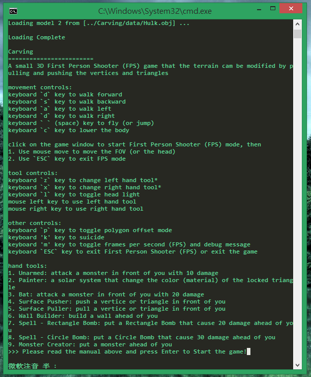  

Press enter and there will be a windows with blue sky and green surface of the world:  

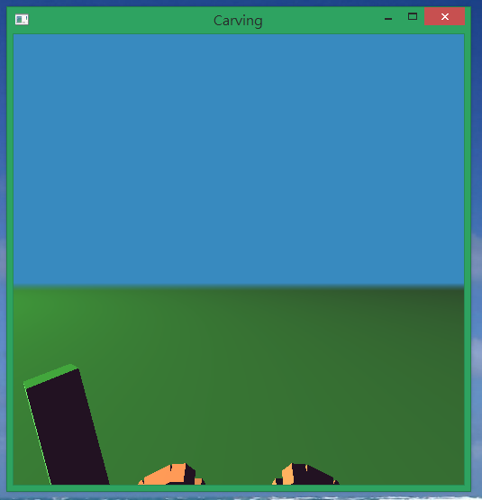  

Click on the windows will let user to control the FOV by moving the mouse around. Also, just like other FPS game, `w`, `s`, `a` and `d` key will move the user's character:  

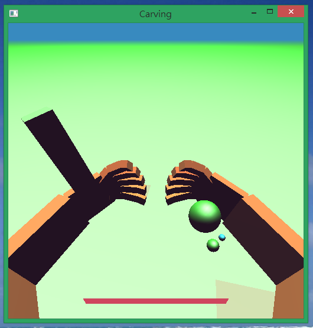  

Use ` ` (space) to jump ... or fly:  

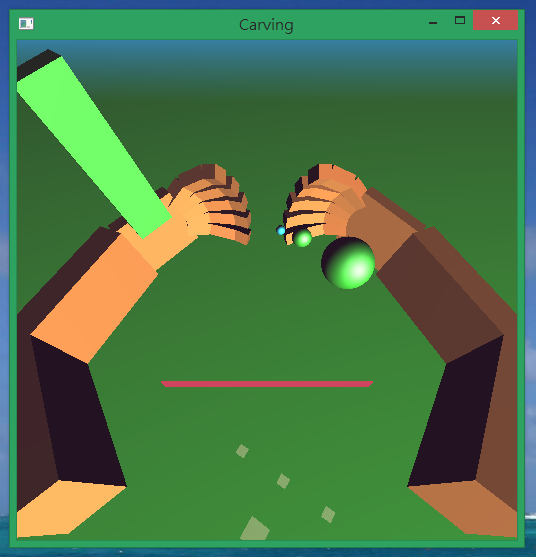  

User hand tool is equipped with `Surface Puller` on left hand and `Monster Creator` on right hand by default, click left mouse key to use left hand's tool:  

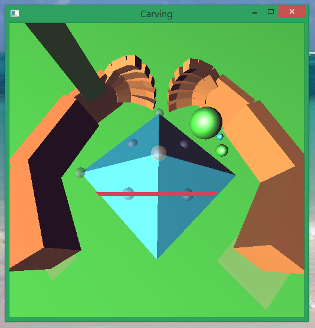  

, so as right hand, this tools `Monster Creator` will put a monster ahead of user:  

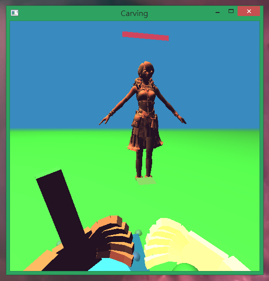  

There are many tools for one hand to switch, press keyboard `z` key to change for left hand or keyboard `x` key to change for right hand:  

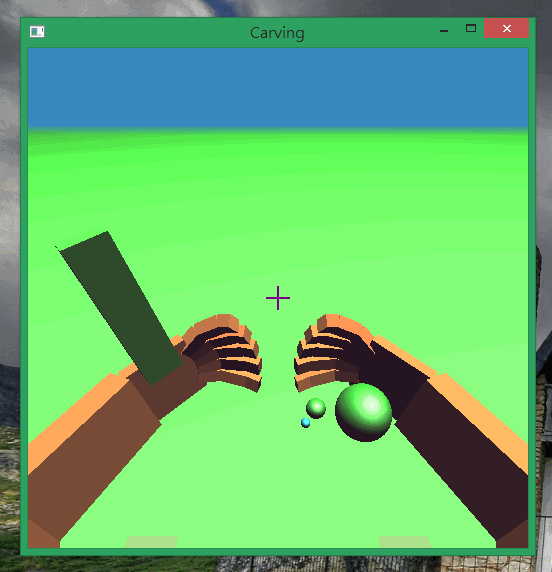  

Tools `Unarmed` and `Bat` are simply for short-range attacking the monsters:  

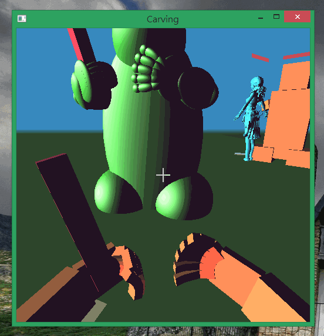  

Tools `Surface Pusher` and `Surface Puller` are used to change the terrain by pushing and pulling the vertices and triangles:  

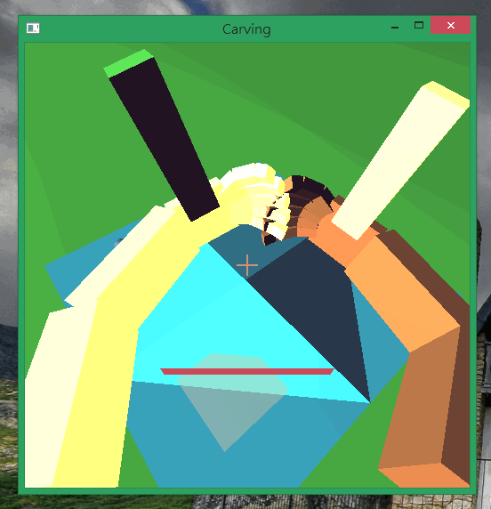  

Tools `Wall Builder` can be used to build a wall that block user and monster's way:  

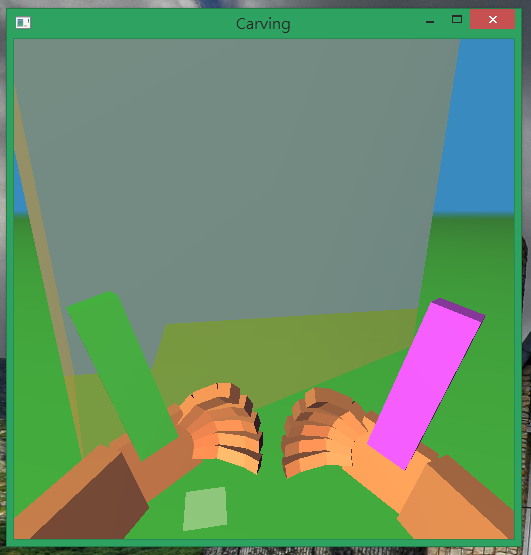  

Tools `Painter` can be used to change the color (material) of a triangle on the terrain:  

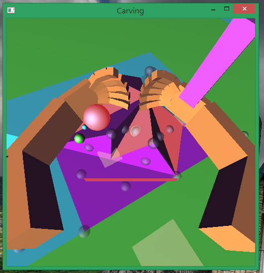  

Tools `Circle Bomb` and `Spell - Rectangle Bomb` are used to do a long range attack, it will put a attacking range on the field an damage the characters inside the range:  

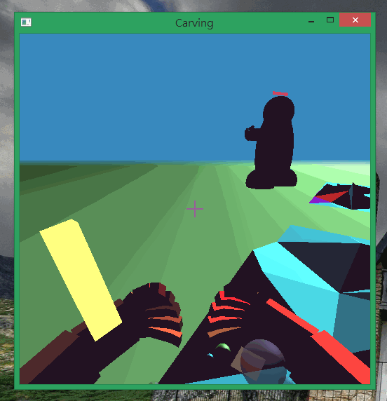  

Combine these tools together, you can use walls to trap monsters you created and use the long range attack to kill them for fun!  

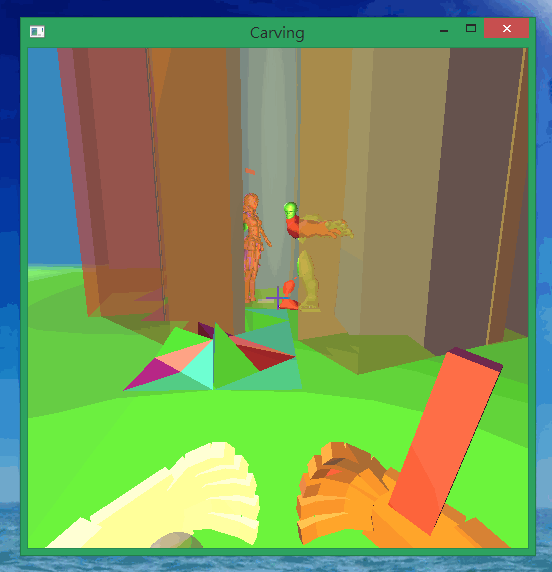  

Or create an unknown terrain and stand on it  

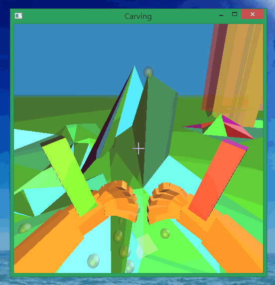  

## Program Structure & Code Description

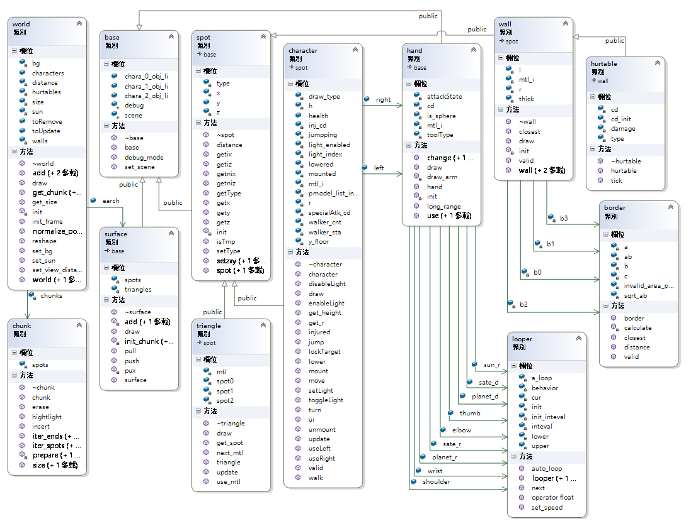  

 * class `base`: a base class to let every sub classes access global variables using `static` attribute
 * class `world`: a container for all the `chunks` and game objects
    * `void world::reshape(int w, int h)` is used to control the view volume
    * `void world::init_frame()` is used to initialize a new frame which contains set the background color
 * class `chunk`: a container to split and index objects in the game, minimizing the routine time
 * class `surface`: the scene renderer and modifier
    * `spot* surface::init_chunk(int z,int x)`: find four nearest point to the four point of the chunk, or create one and establish the chunk
 * class `spot`: base class for objects in the game, most objects extended from this class will be added to `chunks` automatically according to their location
 * class `triangle`: a triangle on the surface to present the terrain
 * class `character`: a user or a monster, contains most interactive method.
    * `spot* character::lockTarget()`: use the user's current pointing angle to create a line, then use the following formula to find one `spot` that is the nearest to the line (M0 represent the testing spot, M1 is the line's origin, s is the line's vector and d the the distance)
        * 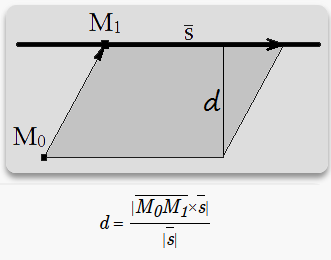
        * Also, this function only search for the three chunk in front of the character to prevent unnecessary calculation
    * the `void character::mount()` will set user's viewing settings and `void character::ui()` will draw user's hands and blood indicator, they need to be called separately
 * class `hand`: perform tool action and UI drawing
 * class `looper`: a helper class to let animation easier to implement on hand displaying
 * class `border`: a `border` instance contains a parameter of a 2D line with valid information
 * class `wall`: using four `border` to arrange a rectangle that is invalid
    * `bool wall::valid(float x,float z)` is to judge if a coordinate is valid
    * `float* wall::closest(float x,float z)` is used to correct a character's coordinate if invalid is detected
 * class `hurtable`: a long-range attack range extended from `wall`, using the same validation system of `wall`

## Future work

 * Add more terrain control tool and make them more easier to create use.
 * Multi-player (client-server) to let many player create world together
 * `.obj` file import and export

## Feedback

This semester I learn a basic technology for game design and programming -- OpenGL. This is the first time I use OpenGL. This may also be the first time I am directly operating my expensive graphic card. Its programming experience is very different from the past project I programmed. The main reason is, I think, the status control. Almost all `gl*` command is to set some status into the graphic card. I believe this is because there is to much parameters when drawing an object on the screen, especially in 3D emulation. This once stock my thinking dramatically when designing the program, there's no way to make some status `private` to encapsulate some features into classes or function in order to prevent other program disturb the display process. After some time, I have adapted to it and just partition these features as `init_frame`, `mount`, `display` and `ui`.  

In this project, I put a lot of time on designing the algorithm about target pointing and collision detection, I found that the math I learned before really helped me. Putting them into the code and struggle to make them work is really hard, but the result make me feel a great sense of accomplishment.  

I may combine this project to other classmate's final project. I found do a project alone is somehow boring, I need someone to think, discuss and develop together in order to create a better game!  

I really learn a lot from this class and this class open a new door for me to explore. After the summer vacation, I will enter the last year of my college life. With this class's experience, I might start some project designing more OpenGL games and making my dream come true. Thank you teacher!  
